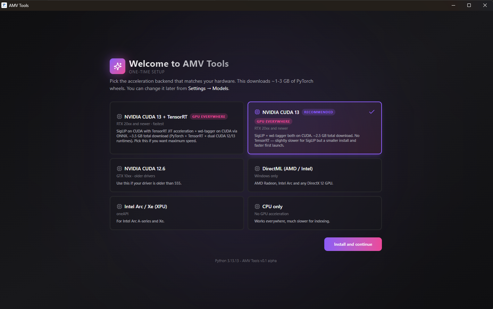
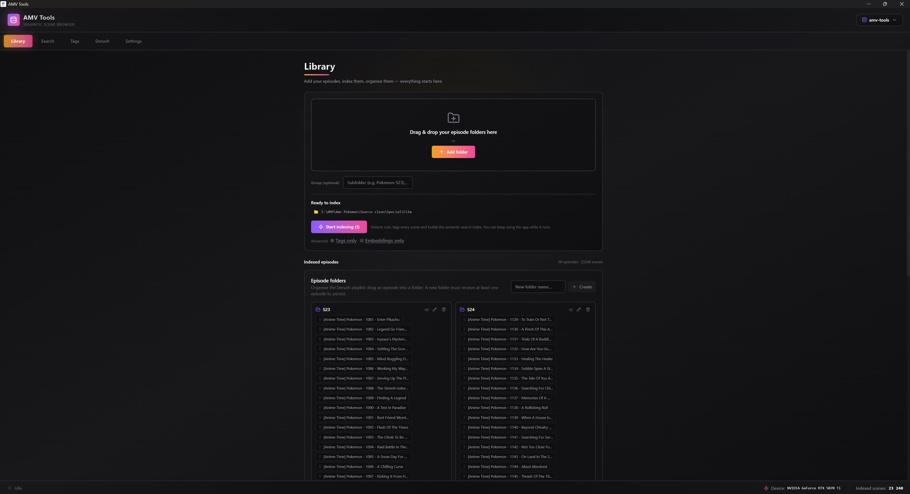
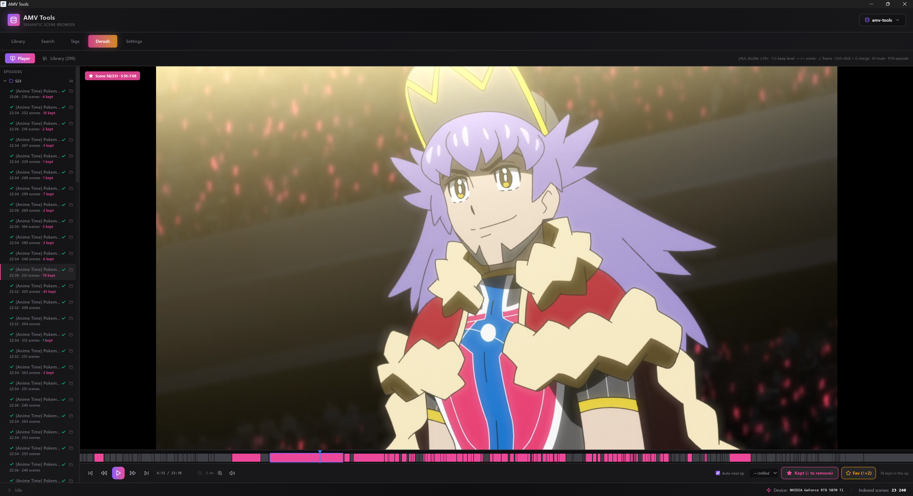
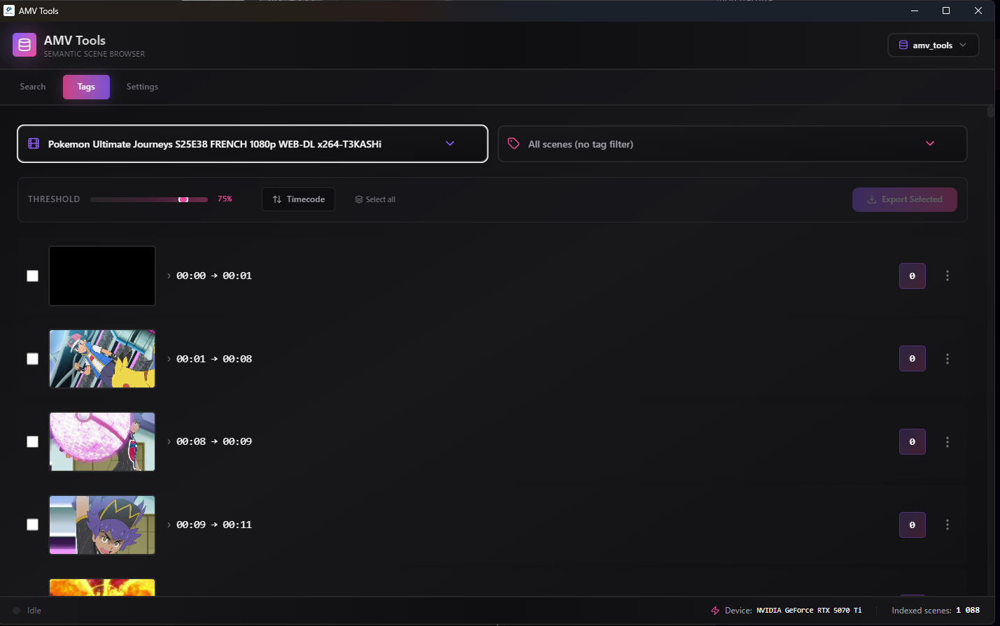
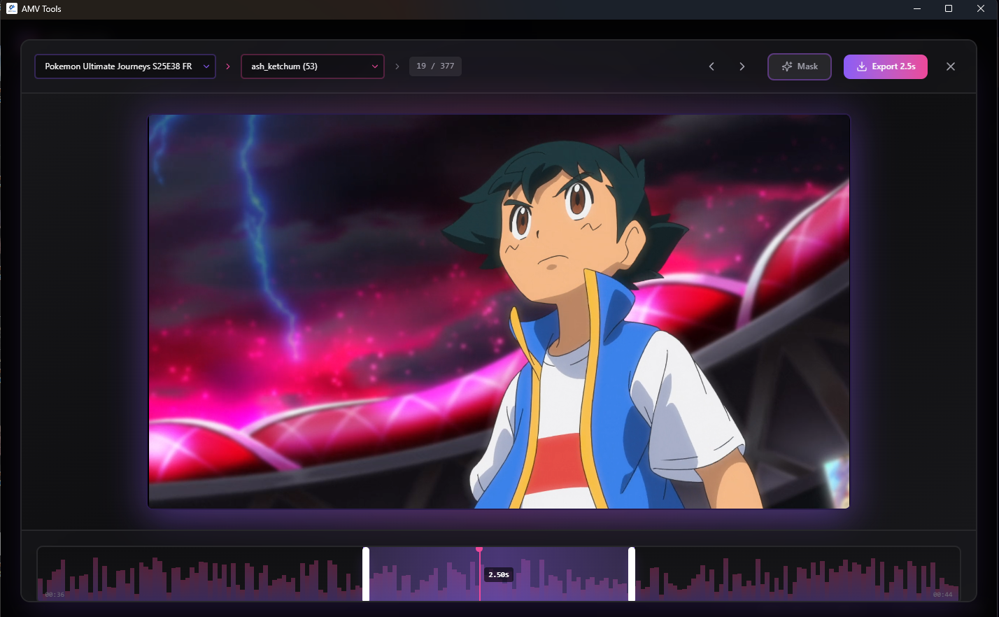
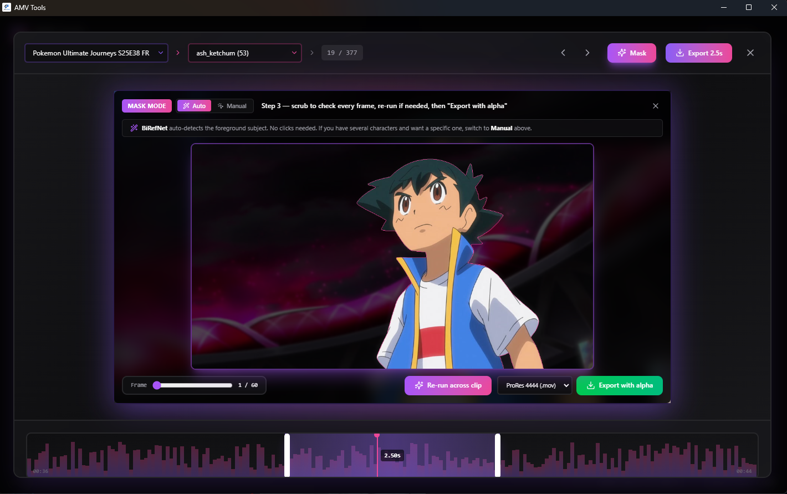

# AMV Tools

<p align="center">
  
</p>

<p align="center">
  <strong>Find the anime shot in your head, trim it, mask it, export it.</strong><br>
  A local-first desktop scene browser for AMV editors and anime clip workflows.
</p>

> [!WARNING]
> **AMV Tools is beta software and is not production-ready.** It still has rough
> edges and bugs: GPU detection can fall back to CPU, model downloads can fail,
> and several flows break on real-world footage. Use it to experiment, not to
> ship. The **roto / alpha-matte (Mask Mode)** feature in particular is **far
> from ready and disabled by default** — matte quality is unreliable. You can
> opt in from `Settings > Models`, but treat it as an experiment.

AMV Tools turns a folder of episodes into a fast, visual editing library. It
indexes your footage locally with semantic search and anime-oriented tags, lets
you derush whole seasons with an Adobe-style player, browse shots by prompt or
tag, then gives you a focused mini editor for clip exports and experimental
alpha-matte cutouts.

The interface is available in **English and French** — switchable live from
`Settings > Interface`, auto-detected from your system on first launch.


## Why It Exists

Editing anime clips should not mean scrubbing through hours of footage trying
to remember where one two-second shot lives. AMV Tools is built for the moment
when you know the vibe, character, color, action, or composition you want, but
not the exact episode timestamp.

- Derush entire seasons with a J/K/L shuttle player and one-key scene keeping.
- Search scenes with natural-language prompts like `Charizard`, `Gojo combat`,
  or `red sky close-up`.
- Browse anime tags generated locally with wd-tagger.
- Trim clips frame-aware before export, alone or in batches.
- Build multiple local SQLite libraries for different projects, and move them
  between machines with one-click relinking.
- Export normal clips or experiment with character cutouts using alpha video.

## Product Tour

### 1. Guided First Launch

On first launch, AMV Tools asks three things: your **acceleration backend**
(NVIDIA CUDA recommended, CPU as the safe fallback — the heavy PyTorch download
only happens for the backend you pick), whether indexing should favor **speed
or accuracy**, and your **language** (English/Français). Everything can be
changed later in Settings.



### 2. The Library Tab — Everything Starts Here

Drop a folder of episodes, optionally give it a group name (`S23`), hit
**Start indexing**. AMV Tools detects cuts, sub-segments long scenes, generates
tags, creates embeddings, and stores everything locally. While it runs you can
already browse what's done. Indexed episodes are organised into drag-and-drop
folders that structure the Derush playlist.



Databases live behind the *advanced* disclosure at the bottom: one database per
project, importable from another PC — when episode files are missing, a relink
panel re-points them by folder, by season, or file by file.

### 3. Derush Episodes Like An Editor

The Derush player plays whole episodes with Adobe-style **J/K/L** shuttle
(reverse to 10× forward), shows every detected cut as a strip under the player,
and keeps the scene under the playhead with a single key. One press keeps,
a second promotes to **favorite** (gold). Episodes chain automatically, arrows
jump between scenes, `,`/`.` step frames, Ctrl+click + G merges over-split
scenes.



### 4. A Library Of Keeps, Ready To Export

Everything you keep lands in the Derush library: hover previews, renaming,
folders, favorites filter, and batch export of the whole selection (or one
folder) in a single click.


### 5. Browse By Tags

The tag browser is made for scanning. Filter a video, raise or lower the
confidence threshold, select the shots you want, and export them as a batch.



### 6. Search Like An Editor

Semantic search gives you a contact sheet of matching shots instead of forcing
you to remember filenames. Sort by relevance, tune the threshold, and hover
through results until the right movement, pose, or color lands. You can also
drop an image to search by visual reference.


### 7. Trim Before Export

Open a result in the mini editor, scrub the clip, adjust the trim handles, and
export exactly the duration you need — designed for short, repeatable clip
pulls, not full timeline editing.



### 8. Experiment With Alpha Cutouts (beta, off by default)

Mask Mode runs an experimental local roto workflow for short clips. **Disabled
by default** — enable it from `Settings > Models` to experiment. BiRefNet can
auto-detect the foreground subject, SAM 2 helps with manual selection, and the
exporter can write alpha formats such as ProRes 4444 or VP9 with transparency.
Matte quality is currently unreliable and not suitable for professional output.



## What Is Inside

- Electron + React desktop shell, bilingual EN/FR.
- FastAPI sidecar for indexing, search, tagging, and exports.
- SQLite scene databases that stay on your machine.
- SigLIP 2 semantic embeddings for visual scene search.
- wd-tagger for anime-oriented tag discovery.
- ffmpeg-based proxies, trim previews, and clip exports.
- Experimental BiRefNet + SAM 2 alpha workflow for short character cutouts.

## Status

**AMV Tools is beta software and still has problems.** Core flows (derush,
search, tagging, preview, trim, export) mostly work, but they depend on source
footage, drivers, and local GPU support, and can break in ways that need manual
recovery. The roto / alpha-matte pipeline is far from ready and disabled by
default. Expect bugs and inconsistent results; please report issues.

The screenshots above use local test footage to demonstrate the interface. AMV
Tools does not ship with media; it indexes files you provide.

## Install On Windows

The recommended path for end users is the Windows installer published on the
project's GitHub Releases page.

1. If you have an NVIDIA GPU, make sure your driver is at least `581.x` for
   CUDA 13. Run `nvidia-smi` in PowerShell to confirm.
2. Download `AMV Tools Setup x.y.z-alpha.exe` from the latest release.
3. Run it. The installer is currently unsigned, so Windows SmartScreen may
   warn you. Choose `More info -> Run anyway`.
4. On first launch, pick the backend that matches your hardware, your indexing
   preference (fast/accurate) and your language. The app downloads the chosen
   PyTorch backend on demand, usually 1-3 GB — a slow connection is fine, the
   bootstrap waits for it.

> [!IMPORTANT]
> **Smart App Control** (enabled by default on some Windows 11 machines) blocks
> unsigned installers outright, with no "run anyway" option. If nothing happens
> when you launch the installer, check `Windows Security > App & browser
> control > Smart App Control`. Disabling it is permanent; the alternative is
> building from source, which is unaffected.

The installer bundles `uv.exe` and the FastAPI sidecar. Model weights and
PyTorch wheels are downloaded into the user data directory when needed. If a
first install is interrupted (network drop, closed app), the next launch
detects the broken environment and repairs it automatically.

### macOS and Linux

Not published yet. The Python environment resolves on macOS but the app has
not been QA'd on Apple Silicon; expect CPU/MPS mode. On those platforms, build
from source (see below) — a GitHub Actions workflow is included to produce
macOS builds on a Mac runner (macOS builds cannot be produced from Windows).

### Moving A Library To Another PC

Copy your `.db` file, install AMV Tools on the new machine, then
`Library > Databases (advanced) > Open existing`. If episode files are not at
their old location, the relink panel opens automatically: point it at the
folder that now contains your episodes (subfolders are scanned recursively),
relink season by season, or fix leftovers file by file. Scenes, tags,
embeddings and derush keeps all survive — no re-indexing.

### Clean Reinstall

If the local environment gets stuck, use `Settings > Advanced > Reinstall from
scratch` inside the app, or wipe manually:

```powershell
Get-Process | Where-Object { $_.ProcessName -like "AMV Tools*" } | Stop-Process -Force -ErrorAction SilentlyContinue
$uninstaller = "$env:LOCALAPPDATA\Programs\amv-tools\Uninstall AMV Tools.exe"
if (Test-Path $uninstaller) { Start-Process -FilePath $uninstaller -ArgumentList "/S" -Wait }
Remove-Item "$env:LOCALAPPDATA\Programs\amv-tools" -Recurse -Force -ErrorAction SilentlyContinue
Remove-Item "$env:APPDATA\amv-tools" -Recurse -Force -ErrorAction SilentlyContinue
```

The Hugging Face model cache under `%USERPROFILE%\.cache\huggingface` is
preserved. Deleting it forces a multi-GB model re-download on next launch.

## Hardware Support

AMV Tools is developed and tested primarily on NVIDIA GPUs (RTX-class, CUDA 12
or 13). That is the recommended path for both indexing and the roto/alpha
pipeline. For any other configuration, CPU mode is the safest fallback — it
works everywhere but indexing is much slower.

The batch size setting auto-recommends a value based on your detected VRAM
(e.g. 12 GB → ≈16); lower it if you hit out-of-memory errors.

DirectML, ROCm, and XPU backends are wired into the installer, but they have
not been validated end-to-end on real AMD or Intel hardware. macOS is in the
same situation. If you are on AMD, Intel, or macOS, expect CPU mode to be the
reliable path.

### NVIDIA Driver Notes

The CUDA 13 backend (`cu130`, recommended for RTX 20xx and newer) needs a
recent NVIDIA driver. If the driver is too old, PyTorch can silently fall back
to CPU and indexing becomes much slower.

| Backend | Minimum driver | Recommended |
| --- | --- | --- |
| `cu130` | 581.x | Latest Game Ready / Studio |
| `cu130-trt` | 581.x | Latest Game Ready / Studio |
| `cu126` | 555.x | 560+ |

Check your driver with `nvidia-smi`. If you cannot update it, choose
`NVIDIA CUDA 12.6` during onboarding instead of CUDA 13.

## Build From Source

Requirements:

- Python 3.12 or 3.13, managed by `uv`.
- Node.js 20+.
- A CUDA-capable NVIDIA GPU for the recommended path, or CPU otherwise.

Install dependencies:

```bash
uv sync --extra cpu
cd app
npm install
```

Run the Electron app in development:

```bash
cd app
npm run dev:electron
```

Build checks:

```bash
uv run python -m compileall backend
cd app
npm run build
```

Create a local unsigned Windows installer:

```bash
cd app
npm run build
npm run build:electron:unsigned
```

The installer is written to `app/release/`. Release artifacts are ignored by
Git; publish them through GitHub Releases instead of committing them.

### Building For macOS

macOS builds must be produced on macOS (electron-builder limitation). On a Mac:

```bash
# Get the uv binary the app bundles
curl -LsSf https://astral.sh/uv/install.sh | sh
mkdir -p .uv && cp "$(command -v uv)" .uv/uv

cd app
npm install
npm run build
npx cross-env CSC_IDENTITY_AUTO_DISCOVERY=false electron-builder --mac
```

Alternatively, the repository ships `.github/workflows/build.yml`, which builds
unsigned Windows and macOS artifacts on GitHub-hosted runners (trigger it from
the Actions tab, or push a `v*` tag).

## Rotoscope Notes

> The roto workflow is **beta, disabled by default, and not production-ready.**
> Enable it under `Settings > Models` only if you want to experiment.

The roto workflow is designed for short clips. Use the mini editor trim handles
before opening Mask Mode; the mask session follows the selected trim range.

Useful settings:

- `Roto resolution`: raises the frame size sent to the roto models. Higher
  values preserve hair detail but are slower.
- `Auto model`: `anime` (ISNet anime-seg) is trained specifically on anime
  characters and is usually the best pick on cel-shaded footage; `HR` can help
  on fine outlines and hair, at a VRAM cost.
- `Edge refine at export`: guided-filter upsampling that snaps the matte edge
  onto full-resolution line work. Nearly free; keep it on.
- `BG-aware edge cleanup`: re-solves the matte edge against the real
  background around the subject. Keep it on.
- `Temporal smoothing`: removes per-frame silhouette flicker from the Auto
  engine; hard cuts reset it automatically.
- `RGB decontaminate export`: slower export path that reduces old-background
  color under semi-transparent edges.
- `Soft-alpha BG cleanup`: use lightly; aggressive cleanup can remove real
  hair or clothing detail.

Automatic roto will not match hand-drawn masks on every anime shot. Fine hair,
motion blur, and low-contrast backgrounds can still need manual cleanup in a
compositor.

## Repository Layout

```text
app/        Electron main process and React renderer (i18n in app/src/i18n)
backend/    FastAPI sidecar, indexing pipeline, model wrappers, export tools
assets/     Icons and screenshots used by the app and README
```

Runtime data, model caches, generated proxies, exports, local databases, and
virtual environments are intentionally ignored by Git.

## Privacy

AMV Tools runs locally. Video files, thumbnails, embeddings, tags, settings,
and exports stay on the user's machine unless they are explicitly moved or
shared. Model weights may be downloaded from Hugging Face, PyTorch, or upstream
model repositories during setup.

## License

MIT. See [LICENSE](LICENSE).
