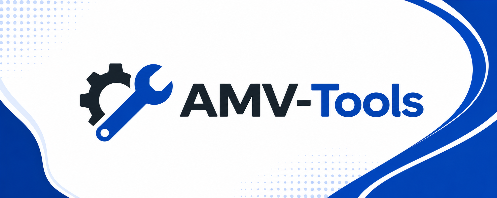
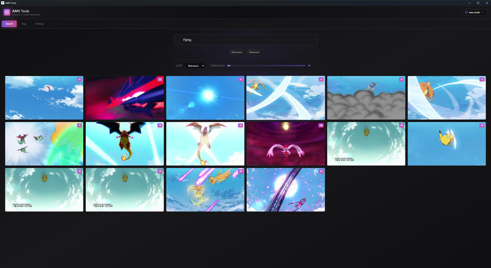

# AMV Tools

<p align="center">
  
</p>

<p align="center">
  <strong>Find the anime shot in your head, trim it, mask it, export it.</strong><br>
  A local-first desktop scene browser for AMV editors and anime clip workflows.
</p>

> [!WARNING]
> **AMV Tools is beta software and is not production-ready.** It still has a lot
> of rough edges and bugs: setup is fragile, GPU detection can silently fall back
> to CPU, model downloads can fail, and several flows break on real-world footage.
> It is not polished enough to rely on for serious work yet. Expect crashes, slow
> paths, and inconsistent results. Use it to experiment, not to ship.
>
> The **roto / alpha-matte (Mask Mode)** feature in particular is **far from ready
> and is disabled by default** — matte quality is unreliable and it is not usable
> for professional output. You can opt in from `Settings > Models`, but treat it
> as an experiment.

AMV Tools turns a folder of episodes into a fast, visual editing library. It indexes
your own footage with semantic search and anime-oriented tags, lets you browse shots
by prompt or tag, then gives you a focused mini editor for clip exports and
experimental alpha-matte cutouts.



## Why It Exists

Editing anime clips should not mean scrubbing through hours of footage trying to
remember where one two-second shot lives. AMV Tools is built for the moment when
you know the vibe, character, color, action, or composition you want, but not the
exact episode timestamp.

- Search scenes with natural-language prompts like `Charizard`, `Gojo combat`, or
  `red sky close-up`.
- Browse anime tags generated locally with wd-tagger.
- Preview indexed shots quickly with ffmpeg proxy clips.
- Trim clips frame-aware before export.
- Build multiple local SQLite libraries for different projects.
- Export normal clips or experiment with character cutouts using alpha video.

## Product Tour

### 1. Pick The Right Backend

On first launch, AMV Tools asks which acceleration backend fits your machine. NVIDIA
CUDA is the recommended path, CPU is the safest fallback, and the installer keeps
the heavy PyTorch download out of the app bundle until you actually choose it.


### 2. Add Your Library

The onboarding keeps the first run simple: add a folder of episodes, index it, then
search. AMV Tools detects cuts, sub-segments long scenes, generates tags, creates
embeddings, and stores everything locally.


### 3. Manage Local Databases

Each project can live in its own database. Drop folders into the queue, run a full
index, tag-only pass, or embeddings-only pass, then switch the active library when
your edit changes direction.


### 4. Browse By Tags While Indexing

The tag browser is made for scanning. Filter a video, raise or lower the confidence
threshold, select the shots you want, and export them as a batch when the search
turns into a usable shortlist.


### 5. Search Like An Editor

Semantic search gives you a contact sheet of matching shots instead of forcing you
to remember filenames. Sort by relevance, tune the threshold, and hover through
results until the right movement, pose, or color lands.


### 6. Trim Before Export

Open a result in the mini editor, scrub the clip, adjust the trim handles, and
export exactly the duration you need. It is designed for short, repeatable clip
pulls, not full timeline editing.


### 7. Experiment With Alpha Cutouts (beta, off by default)

Mask Mode runs an experimental local roto workflow for short clips. **It is disabled
by default** because it is not ready for real use — enable it from `Settings > Models`
if you want to experiment. BiRefNet can auto-detect the foreground subject, SAM 2 can
help with manual selection, and the exporter can write alpha formats such as ProRes
4444 or VP9 with transparency. Matte quality is currently unreliable and not suitable
for professional output.


## What Is Inside

- Electron + React desktop shell.
- FastAPI sidecar for indexing, search, tagging, and exports.
- SQLite scene databases that stay on your machine.
- SigLIP 2 semantic embeddings for visual scene search.
- wd-tagger for anime-oriented tag discovery.
- ffmpeg-based proxies, trim previews, and clip exports.
- Experimental BiRefNet + SAM 2 alpha workflow for short character cutouts.

## Status

**AMV Tools is beta software and still has a lot of problems.** It is not polished
or stable enough to be considered a professional, production-ready tool yet.

- Core flows (search, tagging, preview, trim, export) mostly work, but they still
  depend heavily on source footage, drivers, and local GPU support, and they break
  in ways that need manual recovery.
- Setup is fragile: backend selection, PyTorch downloads, and GPU detection can
  fail or silently fall back to CPU, which makes everything much slower.
- The **roto / alpha-matte (Mask Mode)** pipeline is **far from ready and disabled
  by default**. Matte quality is unreliable and not good enough for professional
  output. It is opt-in from `Settings > Models` and should be treated as an
  experiment, not a finished feature.

Expect bugs, crashes, and inconsistent results. Please report issues rather than
assuming a given flow is supposed to work end-to-end.

The screenshots above use local test footage to demonstrate the interface. AMV Tools
does not ship with media; it indexes files you provide.

## Install On Windows

The recommended path for end users is the Windows installer published on the
project's GitHub Releases page.

1. If you have an NVIDIA GPU, make sure your driver is at least `581.x` for CUDA 13.
   Run `nvidia-smi` in PowerShell to confirm.
2. Download `AMV Tools Setup x.y.z-alpha.exe` from the latest release.
3. Run it. The installer is currently unsigned, so Windows SmartScreen may warn
   you. Choose `More info -> Run anyway`.
4. On first launch, select the backend that matches your hardware. The app downloads
   the chosen PyTorch backend on demand, usually around 1-3 GB.

The installer bundles `uv.exe` and the FastAPI sidecar. Model weights and PyTorch
wheels are downloaded into the user data directory when needed.

Linux and macOS builds are not published yet. On those platforms, build from source.

### Clean Reinstall

If the local environment gets stuck because of a broken venv, stale settings, or a
half-installed backend, wipe the install and user data, then run the installer again:

```powershell
# Stop any running instance
Get-Process | Where-Object { $_.ProcessName -like "AMV Tools*" } | Stop-Process -Force -ErrorAction SilentlyContinue

# Uninstall silently if the uninstaller is still around
$uninstaller = "$env:LOCALAPPDATA\Programs\amv-tools\Uninstall AMV Tools.exe"
if (Test-Path $uninstaller) { Start-Process -FilePath $uninstaller -ArgumentList "/S" -Wait }

# Remove install dir + user data: settings, venv, db, logs, proxies
Remove-Item "$env:LOCALAPPDATA\Programs\amv-tools" -Recurse -Force -ErrorAction SilentlyContinue
Remove-Item "$env:APPDATA\amv-tools" -Recurse -Force -ErrorAction SilentlyContinue
```

The Hugging Face model cache under `%USERPROFILE%\.cache\huggingface` is preserved.
Deleting it forces a multi-GB model re-download on next launch.

## Hardware Support

AMV Tools is developed and tested primarily on NVIDIA GPUs, especially RTX-class
cards with CUDA 12 or CUDA 13. That is the recommended and most stable path for
both indexing and the roto/alpha pipeline.

For any other configuration, CPU mode is the safest fallback. It works everywhere,
but indexing and roto are much slower.

DirectML, ROCm, and XPU backends are wired into the installer, but they have not
been validated end-to-end on real AMD or Intel hardware. macOS is in the same
situation: the Python environment resolves, but the app has not been QA'd on Apple
Silicon. If you are on AMD, Intel, or macOS, expect CPU mode to be the reliable path.

### NVIDIA Driver Notes

The CUDA 13 backend (`cu130`, recommended for RTX 20xx and newer) needs a recent
NVIDIA driver. If the driver is too old, PyTorch can silently fall back to CPU,
indexing becomes much slower, and the roto pipeline may fail to initialize.

| Backend | Minimum driver | Recommended |
| --- | --- | --- |
| `cu130` | 581.x | Latest Game Ready / Studio |
| `cu130-trt` | 581.x | Latest Game Ready / Studio |
| `cu126` | 555.x | 560+ |

Check your driver from a terminal:

```powershell
nvidia-smi
```

If you cannot update the driver, choose `NVIDIA CUDA 12.6` during onboarding instead
of CUDA 13.

## Build From Source

Requirements:

- Python 3.12 or 3.13, managed by `uv`.
- Node.js 20+.
- A CUDA-capable NVIDIA GPU for the recommended path, or CPU otherwise.

Install dependencies:

```bash
uv sync --extra cpu
cd app
npm install
```

Run the Electron app in development:

```bash
cd app
npm run dev:electron
```

Build checks:

```bash
uv run python -m compileall backend
cd app
npm run build
```

Create a local unsigned Windows installer:

```bash
cd app
npm run build
npm run build:electron:unsigned
```

The installer is written to `app/release/`. Release artifacts are ignored by Git;
publish them through GitHub Releases instead of committing them.

## Rotoscope Notes

> The roto workflow is **beta, disabled by default, and not production-ready.**
> Enable it under `Settings > Models` only if you want to experiment; do not expect
> professional-quality mattes.

The roto workflow is designed for short clips. Use the mini editor trim handles
before opening Mask Mode; the mask session follows the selected trim range.

Useful settings:

- `Roto resolution`: raises the frame size sent to the roto models. Higher values
  preserve hair detail but are slower.
- `BiRefNet variant`: `HR` can help on fine outlines and hair, at a VRAM cost.
- `RGB decontaminate export`: slower export path that reduces old-background color
  under semi-transparent edges.
- `Soft-alpha BG cleanup`: use lightly; aggressive cleanup can remove real hair or
  clothing detail.

Automatic roto will not match hand-drawn masks on every anime shot. Fine hair,
motion blur, and low-contrast backgrounds can still need manual cleanup in a
compositor.

## Repository Layout

```text
app/        Electron main process and React renderer
backend/    FastAPI sidecar, indexing pipeline, model wrappers, export tools
assets/     Icons and screenshots used by the app and README
```

Runtime data, model caches, generated proxies, exports, local databases, and virtual
environments are intentionally ignored by Git.

## Privacy

AMV Tools runs locally. Video files, thumbnails, embeddings, tags, settings, and
exports stay on the user's machine unless they are explicitly moved or shared.

Model weights may be downloaded from Hugging Face, PyTorch, or upstream model
repositories during setup.

## License

MIT. See [LICENSE](LICENSE).
